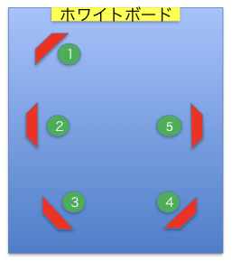

# Shell scriptで液晶ディスプレイを操作する
204号室に設置されているプレゼンテーション用大型液晶ディスプレイは、Ethernet接続してネットワーク経由で制御することができる。

ここでは、5台あるディスプレイの電源を、いちいちリモコンを使って一つずつ入れたり切ったりしなくていいように、PCから一度に操作できるようにすることを考える。

## コマンド
まずは、機器を制御するためのコマンドを調べなければならない。

SONYの制御用コマンドが記載されているマニュアルは、一般には入手できないので、販売代理店に依頼して送ってもらった。
印刷したものが計算機室に置いてあるので、参照されたい。

>警告
このマニュアルは、サービス専用です。
お客様が、このマニュアルに記載された設置や保守、点検、
修理などを行うと感電や火災、人身事故につながることがあります。
危険を避けるため、サービストレーニングを受けた技術者のみご使用ください。

という脅し文句が書いてあるのだが、臆せず続けることにする。

ネットワーク経由で制御する方式はID Talkと呼ばれるもので、第3章に書いてある。

これを解読すると、電源を操作するには、次のようなデータをディスプレイのTCPポート53484に送ってやればよいことがわかる。（0x??は16進表記で１バイトを表す）

電源ONのデータ（ページ4-2参照）
>0x02 0x10 0x53 0x4F 0x4E 0x59 0x00 0xF1 0x00 0x06 0x8C 0x00 0x00 0x02 0x01 0x8F

電源OFFのデータ（スイッチコードはページ5-1参照）
>0x02 0x10 0x53 0x4F 0x4E 0x59 0x00 0xF1 0x00 0x06 0x8C 0x00 0x00 0x02 0x00 0x8E

## Shell
こういった機器の制御には、C言語が使われることが多いが、ここでは、テストしながら気楽に開発できるshell scriptを使ってみる。

Shell scriptでは文字列を扱うことが多く、上のようなバイナリデータの扱いは一般にはあまり得意ではない。しかし、bashビルトインのechoコマンドには-eオプションがあり、16進表記したバイナリデータを扱うことができる。

問　bashのマニュアルページを見て、echo -eの機能を調べよ。

試してみる。（xxdコマンドが入っていなかったら入れておく）

```
$ echo -e -n '\x02''\x10'"SONY"'\x00''\xf1''\x00''\x06''\x8c''\x00''\x00''\x02''\x01''\x8f' > binary
$ xxd binary
0000000: 0210 534f 4e59 00f1 0006 8c00 0002 018f  ..SONY..........
```

もう一つのshell scriptの問題点は、ネットワークを扱う機能がないことだが、そういう時に便利なnetcat（コマンド名は`nc`）というソフトウェアがあるので大丈夫。

問　ncコマンドがインストールされているかどうかを調べ、まだならインストールせよ。マニュアルページで使い方を見ておくこと。

ncを試してみよう。「端末」の窓を２つ開く。

端末１
```
$ nc -l -p 53484
```

端末２
```
$ nc localhost 53484
```

端末１でサーバ（ポート番号53484）を起動し、端末２からそのサーバに接続したということになる。`localhost`は今使っている自分のコンピュータを表す。

どちらかの端末でキーボードから文字を入力すると、反対側に送られて表示される。入力終了は^Dで。

なお、液晶ディスプレイからは成功・失敗のレスポンスが返信されるが、成功したか失敗したかはディスプレイを見ればわかるので、デバッグ時以外は気にしないことにする。
Script
液晶ディスプレイの配置とIPアドレスの対応は以下の通り。


```
 1	 192.168.1.45
 2	 192.168.1.42
 3	 192.168.1.43
 4	 192.168.1.44
 5	 192.168.1.41
```

以上の情報を組み合わせて、一度に電源ON/OFFできるようにしたのが添付の`powersw`というshell scriptである。使い方は引数なしで動かしてみればわかる。ただし、これを実行するとディスプレイの電源が実際にON/OFFされてしまうので、実行してみるなら下のものを。

## その他
マニュアルを見ると他にもいろいろなコマンドがあるが、役に立ちそうなものは多くない。画面解像度などを表示するstatus displayを行うスクリプト`statusdisp`も作成した。電源ON/OFFに比べて害がないので、試してみて。

## やってみる
Githubからファイルをダウンロードする。
```
$ git clone https://github.com/utmsks/lcdshell.git
```
（うまくいかないときは[githubへのアクセス](https://github.com/utmsks/KSImaterial/blob/master/contents/network/github.md)の準備をしておく。

lcdshellというディレクトリができ、そこに`statusdisp`などのコマンドがある。
